  

 

## 정성원 · Backend / Platform Engineer

Go로 백엔드를 짓고, 그걸 직접 쿠버네티스에 올려 운영합니다.
Clean Architecture + Hexagonal을 기본 골격으로 쓰고, 설계 결정은 패턴 문서로 남겨 다음 서비스에 재사용합니다.

요즘 관심은 **"혼자서 프로덕션 등급 플랫폼을 얼마나 싸게 굴릴 수 있는가"** 입니다.
지금 운영 중인 서비스는 OCI 무료 티어 OKE(ARM A1 · 4 OCPU · 24GB) 클러스터 위에서 **월 0원**으로 돌아갑니다.

 

### 지금 하고 있는 것

| | |
|---|---|
| **운영 클러스터** | OCI 무료 티어 OKE · Traefik v3 인그레스 · cert-manager + Let's Encrypt 자동 갱신 |
| **아키텍처** | Go · Gin · Clean + Hexagonal / MSA 경로 기반 라우팅 `/api/{service}/{endpoint}` |
| **프론트** | Next.js 16 · FSD 레이어링 · TypeScript |
| **배포** | arm64 이미지 → OCIR → K8s 롤아웃, feature 브랜치 + PR 기반 |

 

### 기술 스택

 

### 공개 저장소

히어로 그래프의 노드들은 진행 중인 비공개 작업이라 링크가 없습니다.
공개해 둔 학습·실험 저장소는 아래에 있습니다.

| 저장소 | 내용 |
|---|---|
| [`mcp-with-go`](https://github.com/Jseongwon/mcp-with-go) | Go로 MCP 서버 구현 |
| [`kubernetes-study`](https://github.com/Jseongwon/kubernetes-study) | 쿠버네티스 운영 실습 |
| [`rabbit-mq-with-go`](https://github.com/Jseongwon/rabbit-mq-with-go) | Go + RabbitMQ 메시징 |
| [`speckit-study`](https://github.com/Jseongwon/speckit-study) | 스펙 주도 개발 실험 |
| [`harness-engineering-study`](https://github.com/Jseongwon/harness-engineering-study) | 에이전트 하네스 구조 정리 |
| [`msa-study-in-go`](https://github.com/Jseongwon/msa-study-in-go) | Go 마이크로서비스 구성 |
| [`Pion_demo`](https://github.com/Jseongwon/Pion_demo) | Pion 기반 WebRTC 데모 |
| [`FirebaseManagementService`](https://github.com/Jseongwon/FirebaseManagementService) | Firebase 관리 서비스 |

 

---

히어로 이미지는 손으로 그린 SVG입니다 — `assets/build_hero.py`의 데이터만 고치고 다시 실행하면 갱신됩니다.
